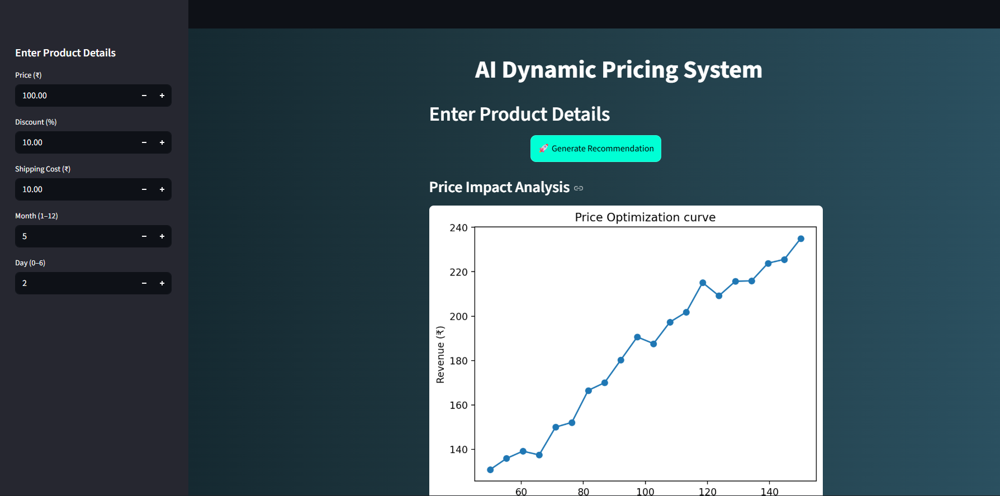
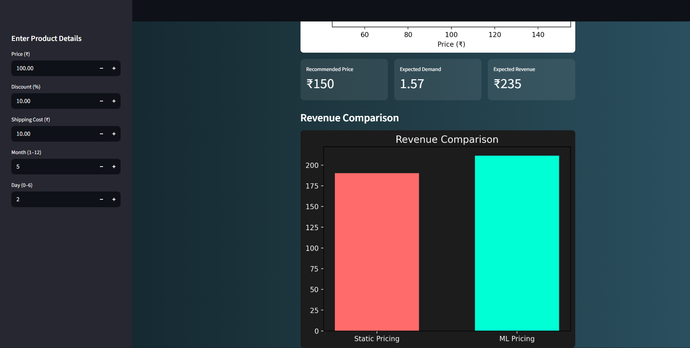

# 🧠 AI Dynamic Pricing System

## 📌 Project Overview

The **AI Dynamic Pricing System** is a machine learning-powered application that recommends optimal product prices to maximize revenue based on predicted demand.

Traditional static pricing methods fail to adapt to demand changes. This project uses machine learning models such as **XGBoost** and **LightGBM** to dynamically predict demand and identify the price that generates the highest expected revenue.

The system is deployed using **Streamlit**, providing an interactive interface where users can input product details and visualize pricing insights.

---

# 🎯 Objective

The primary objectives of this project are:

- Predict product demand using machine learning
- Recommend optimal pricing strategies
- Compare static pricing with ML-based pricing
- Improve revenue using dynamic pricing
- Provide interactive visualization through Streamlit

---

# ❗ Problem Statement

Many businesses rely on fixed pricing strategies that do not adapt to customer demand or seasonal trends. This leads to revenue loss and inefficient pricing decisions.

This project solves the problem by:

- Predicting demand using machine learning
- Evaluating multiple price points
- Selecting the price that maximizes revenue
- Comparing performance with traditional pricing methods

---

# 📊 Dataset Description

## 📌 Source of Data

Retail Store Inventory Dataset

File Used: retail_store_inventory.csv

**Dataset Size:**
- Total Rows: 51290  
- Total Columns: 27  

---

## 📌 Features Used

The following features were used to train the machine learning models:

- **Price**
- **Discount**
- **Shipping Cost**
- **Month**
- **Day of Week**

### 🎯 Target Variable:

- **Demand**

---

---

# 🔄 Project Workflow

## 1️⃣ Data Ingestion

- Loaded dataset using **Pandas**
- Verified missing values
- Checked data types
- Ensured dataset consistency

---

## 2️⃣ Data Processing

Performed:

- Handling missing values
- Feature engineering
- Feature scaling
- Train-test split

Libraries used:

- Pandas
- NumPy
- Scikit-learn

---

## 3️⃣ Exploratory Data Analysis (EDA)

Performed:

- Demand distribution analysis
- Price vs Demand visualization
- Monthly demand trends
- Correlation analysis

Libraries used:

- Matplotlib
- Seaborn

---

## 4️⃣ Baseline Pricing

Implemented:

- Static pricing logic
- Traditional revenue calculation

Formula used:  Revenue = price x demand

Used as baseline for comparison.

---

## 5️⃣ Machine Learning Model Development

Models trained:

- **XGBoost**
- **LightGBM**

Steps performed:

- Model training
- Hyperparameter tuning
- Performance evaluation
- Model comparison

Best model saved as:  
Used as baseline for comparison.

---

## 5️⃣ Machine Learning Model Development

Models trained:

- **XGBoost**
- **LightGBM**

Steps performed:

- Model training
- Hyperparameter tuning
- Performance evaluation
- Model comparison

Best model saved as: models/best_model.pkl

---

# 🤖 Model Details

## 🔹 XGBoost

**XGBoost (Extreme Gradient Boosting)** is a powerful tree-based algorithm known for high prediction accuracy and performance.

### Advantages:

- High accuracy
- Handles complex relationships
- Reduces overfitting
- Fast computation

---

## 🔹 LightGBM

**LightGBM** is an efficient gradient boosting framework designed for speed and performance.

### Advantages:

- Faster training
- Memory efficient
- Works well with large datasets

---

## 📌 Evaluation Metrics

Models were evaluated using:

- Mean Absolute Error (**MAE**)
- Mean Squared Error (**MSE**)
- R² Score

### Model Performance:

| Model | MAE | RMSE | R² Score |
|------|-----|------|-----------|
| XGBoost | 1.12 | 1.64 | 0.46 |
| LightGBM | 1.20 | 1.64 | 0.47 |
| Baseline Model | 1.85 | 2.20 | 0.72 |

The best-performing model was selected for deployment.

---

# 💰 Pricing Strategy

## Rule-Based Pricing

Static pricing assumes:

- Fixed pricing structure
- Average historical demand

Used as a baseline.

---

## ML-Based Pricing

Dynamic pricing strategy:

1. Generate multiple price points
2. Predict demand for each price
3. Calculate revenue
4. Select price with highest revenue

Outputs generated:

- Recommended Price
- Expected Demand
- Expected Revenue

---

# 📈 Results

## Revenue Comparison

The system compares:

- Static Pricing
- ML-Based Pricing

Result:

ML-based pricing consistently produces higher revenue compared to static pricing.

---

## 📊 Key Insights

- Revenue changes significantly with price adjustments
- Optimal pricing improves profitability
- Demand prediction improves pricing decisions
- Machine learning enables smarter pricing strategies

---

# 🖥️ Application / Demo

The application is built using **Streamlit**.

Users can:

- Enter product details
- Generate pricing recommendations
- View price optimization curves
- Compare revenue strategies
- Analyze price impact on revenue

---

## Dashboard Outputs

The Streamlit dashboard displays:

- Recommended Price
- Expected Demand
- Expected Revenue
- Price Optimization Curve
- Revenue Comparison Chart

---

# 📸 Screenshots

---

# 📌 How to Run the Project

## Step 1 — Clone Repository
https://github.com/springboardmentor82023/AI_Price_Optima/tree/gurusivananda-model

---

## Step 2 — Navigate to Project Directory
cd AI_PRICE_OPTIMA

---

## Step 3 — Install Dependencies
pip install -r requirements.txt

---

## Step 4 — Run Streamlit Application

streamlit run app/app.py

The Project is deployed using : Streamlit Cloud

Deployed Link:- https://ai-price-optima-gurusivananda.streamlit.app/

